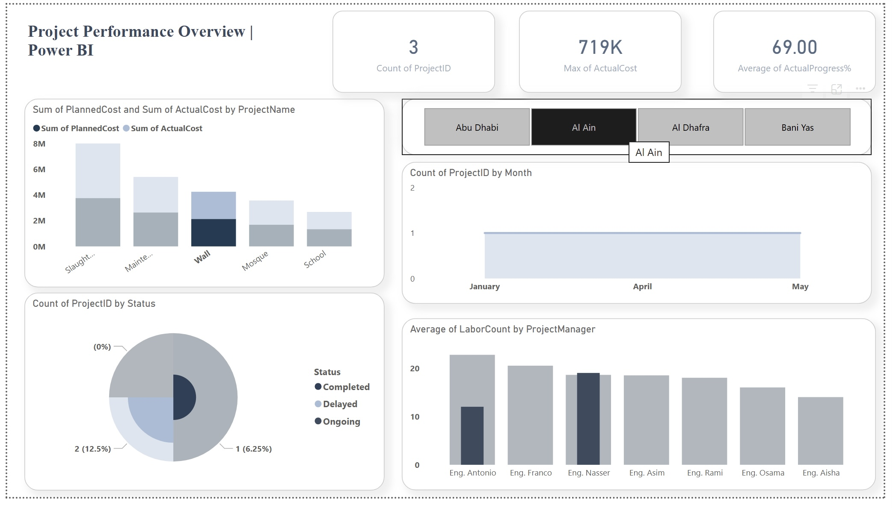

# Project Performance Dashboard | Power BI

## ✦ Overview
This project presents an interactive dashboard built using Microsoft Power BI to analyze and monitor project performance.

The dashboard provides insights into project progress, cost comparison, labor distribution, and project trends over time.

---

## ✦ Key Insights
- Total number of projects
- Highest actual project cost
- Average project progress
- Planned vs Actual cost comparison
- Project distribution by status (Completed, Ongoing, Delayed)
- Labor allocation across project managers
- Project start trends over time

---

## › Project Type
Final project completed after a Data Analysis Bootcamp. The dataset used for the analysis is also included in the project files.

---

## ✦ Dashboard Preview

## 🪄 Author
Ghala Althubaity
